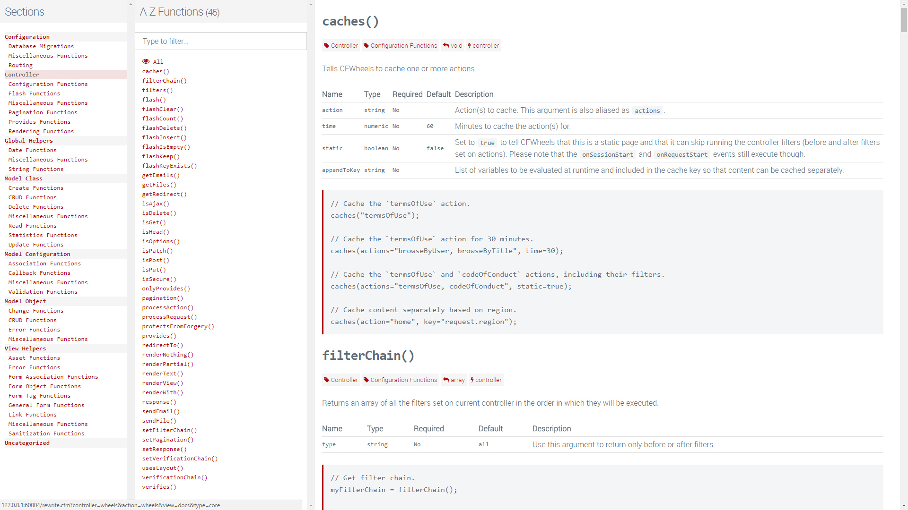
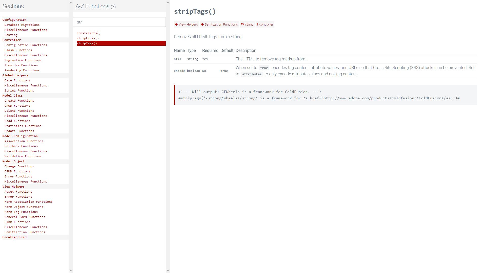

# Documenting your Code

One of a developer’s biggest time sinks is coming up with and writing accurate and engaging documentation. Even if it’s an internal project with.. well, just you… it’s still incredibly valuable to have: coming back to projects a few months or even years later can often lead to a bit of head scratching and screams of “why?”, especially with your own code.

Whilst we’re not promising that CFWheels will write all your documentation for you, we have put some tools in place to hopefully make the process a little less painful. With a small amount of adjustment in how you document your core functions, documentation doesn’t necessarily have to be such a time consuming process.

In the CFWheels core, we've adopted javadoc-style syntax (with a few twists of our own) to automatically create our main documentation, and there's nothing stopping you adding to this core set of documentation for your own app. It just needs a bit of markup.

### Browse the Core API

The first thing to notice is the new ‘\[View Docs]’ link in the debug section in the footer:\
Following that link leads you to the main internal documentation.&#x20;



The three column layout is designed to allow for quick filtering by section or function name. On the left are the main CFWheels core categories, such as Controller and Model functions, which are then broken down into sub categories, such as Flash and Pagination functions etc. Clicking on a link in the first column will filter the list in the second and third columns with all the functions which match (including child functions of that category).

Filtering by function name is made simple by a “Filter as you type” search field in the second column, so getting to the right function should be very quick.

The third column contains the main function definition, including tags, parameters and code samples.

### How is it generated?

Each function in the core is now appropriately marked up with javaDoc style comments. This, combined with `getMetaData()` allows us to parse the markup into something useful.

Example Core Function


```java
/**
 * Removes all HTML tags from a string.
 *
 * [section: View Helpers]
 * [category: Sanitization Functions]
 *
 * @html The HTML to remove tag markup from.
 */
public string function stripTags(required string html) {
    local.rv = REReplaceNoCase(arguments.html, "<\ *[a-z].*?>", "", "all");
    local.rv = REReplaceNoCase(local.rv, "<\ */\ *[a-z].*?>", "", "all");
    return local.rv;
}
```


The `[section]` and `[category]` tags categorise the function as appropriate, and the `@html` part describes the function’s parameter. The additional parameter data, such as whether it’s required, type and any defaults are automatically parsed too. This results in a display like:



### Documenting your own functions

Any function which is available to `Controller.cfc` or `Model.cfc` is automatically included; if there’s no javaDoc comment, then they’ll appear in `uncategorized`. But of course, there’s nothing stopping you creating your own `[section]` and `[category]` tags, which will then automatically appear on the left hand column for filtering: you’re not restricted to what we’ve used in the core.

As an example, if you wanted to document all your filters, you might want to have a `[section: Application]` tag, with `[category: filters]`. This way, your application documentation grows as you create it.

Something as simple as a sublime text snippet for a new function which includes the basic javaDoc skeleton can get you in the habit pretty quickly!

### Plugins too!

We also introspect plugins for the same markup. We encourage plugin authors to adjust their plugin code to include `[section: Plugins]` at the very least.&#x20;

### Exports & Re-use

You can export the docs via JSON just by changing the URL string:\
i.e `?controller=wheels&action=wheels&view=docs&type=core&format=json`

You could also include the functions used to create the docs and create your own version (perhaps useful for a CMS or other application where you have internal documentation for authenticated users). Whilst this isn’t officially supported (the main functions may be subject to change!) it is technically possible. The best example is the thing itself – see the main output if you’re interested. Please note that the user interface isn’t available in production mode (for obvious reasons we hope!), so if you wanted to expose this data to an end user, you would probably need to “roll your own” with this approach.

### Updating

Note that the CFC introspection doesn’t automatically happen on every request, so you will need to `?reload=true` to see changes to your code. Additionally, Adobe ColdFusion is more aggressive in caching CFC metadata, so depending on your settings, you may not see changes until a server restart.

### Code samples

Whilst the core has additional code samples which can be loaded from text files, there’s no support for your application functions to take advantage of this yet.

### Roadmap

Whilst this API/function explorer is a great first step, you’ll notice your controller and model specific functions aren’t included (only those shared amongst controllers, or in the `/global/functions.cfm` file. This is because we’re only looking at the main `Model.cfc` and `Controller.cfc` and what it can access.

In CFWheels 2.1, we’ll look at adding a full Controller and Model metadata explorer using the same techniques, and map functions like `show()` to their respective routes too.
