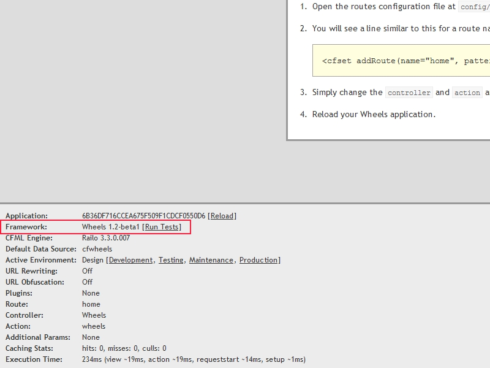

# Testing the Wheels Framework Itself

Though the core team tests each new release of Wheels against a variety of environments, there is no
possible way for them to test against them all. This is where you can help them tremendously! We
encourage everyone to test each new release of Wheels against their current setup and
[report any bugs][10] back to the core team.

## CFML and Database Engines

We're not going to go through actually installing and configuring one of the supported CFML engines
(currently [Railo][2] and [Adobe ColdFusion][3]) as we will assume that you already have them installed
and working. If not, there is [extensive documentation][9] on how to do so. We will say that if you've
never installed and configured a CFML engine before (or just don't have one and still want to help out),
the easiest thing to do is to download the [Railo Express][1] installer.

You will also need to install one of the supported databases (currently [Microsoft SQL Server][4],
[MySQL][5], [Oracle][6], [PostgresSQL][7] an [H2][8]). Again, we're not going to go through the entire
setup and installation of these since we're going to assume that you already have them installed. If
not, again, there is [extensive documentation][9] out there on how to install these on your current
operating system.

## Datasource

In order run the framework tests, you will need to configure a datasource name `wheelstestdb` in your
CFML engine's administrator.

The first step is to create an _EMPTY_ database on your database server called `wheelstestdb`. You also
need to create a user called `wheelstestdb` with the password of `wheelstestdb` and give it _FULL_
access to this database. 

After creating the database, you will need to go into your CFML Engines administrator and create a
datasource called `wheelstestdb` (you seeing the pattern here?) pointing to the `wheelstestdb` database.
It is _VERY IMPORTANT_ that you give the datasource CLOB and BLOB supprt (or the equivalent to your
database engine) by going into the **Advanced** options of the datasource when setting it up.

## Running the Tests

As you can see, the setup isn't all that complicated. It's something every developer has done thousands
of times. After setting everything up, you would think that running the test would be just as easy as
well. Well we hate to disappoint you, but they are :)

On the Wheels welcome page (the page that comes up when you first install wheels), you should see the
debug area (that grey area at the bottom of the page):

**Figure 1: Wheels debug area, highlighting the link to run the framework tests**

In the debug area you should see a `[Run Tests]` link on the `Framework` line, to the right of the
version of Wheels you have installed.

Now here is where it gets __VERY__ difficult, so pay attention... click that link :)

## Aftermath

After all the tests run (which could take upwards of **10 minutes** depending on your CFML engine),
[open a ticket][10] for any failing tests.

## Thank you

You have no idea how something so simple can be of such a value to the stability of the framework and
the project as a whole. For that we want to thank you for taking the time to run the framework tests
for Wheels. 

[1]: http://www.getrailo.org/index.cfm/download/
[2]: http://www.getrailo.org
[3]: http://www.adobe.com/coldfusion
[4]: http://www.microsoft.com/express/database/
[5]: http://www.mysql.com/downloads/mysql/
[6]: http://www.oracle.com/technetwork/products/express-edition/downloads/index.html
[7]: http://www.postgresql.org/download/
[8]: http://www.h2database.com/html/download.html
[9]: http://www.google.com/
[10]: https://github.com/cfwheels/cfwheels/issues
